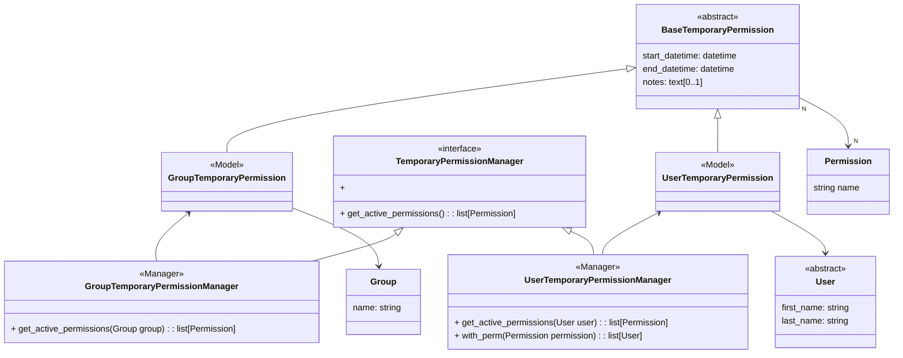
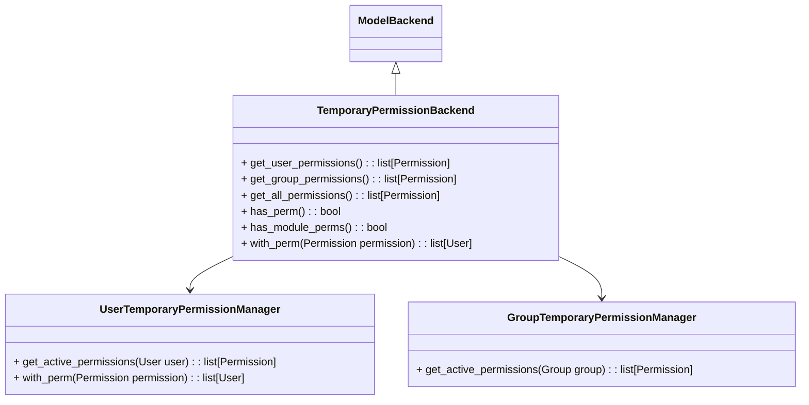

# Models

```mermaid
classDiagram
    class Permission {
        string name
    }
    
    class BaseTemporaryPermission {
        <<abstract>>
        start_datetime: datetime
        end_datetime: datetime
        notes: text[0..1]
    }
    BaseTemporaryPermission "N" --> "N" Permission
    
    class User {
        <<abstract>>
        first_name: string
        last_name: string
    }
    
    class Group {
        name: string
    }
    
    class TemporaryPermissionManager {
        <<interface>>
        + get_active_permissions(): list[Permission]
        + 
    }
    
    class UserTemporaryPermission {
        <<Model>>
    }
    UserTemporaryPermission --> User
    BaseTemporaryPermission <|-- UserTemporaryPermission
    
    class GroupTemporaryPermission {
        <<Model>>
    }
    GroupTemporaryPermission --> Group
    BaseTemporaryPermission <|-- GroupTemporaryPermission
    
    class UserTemporaryPermissionManager {
        <<Manager>>
        + get_active_permissions(User user): list[Permission]
        + with_perm(Permission permission): list[User]
    }
    UserTemporaryPermission <-- UserTemporaryPermissionManager
    TemporaryPermissionManager <|-- UserTemporaryPermissionManager
    
    class GroupTemporaryPermissionManager {
        <<Manager>>
        + get_active_permissions(Group group): list[Permission]
    }
    GroupTemporaryPermission <-- GroupTemporaryPermissionManager
    TemporaryPermissionManager <|-- GroupTemporaryPermissionManager
```

# Authentication backend

```mermaid
classDiagram
    class ModelBackend
    
    class TemporaryPermissionBackend {
        + get_user_permissions(): list[Permission]
        + get_group_permissions(): list[Permission]
        + get_all_permissions(): list[Permission]
        + has_perm(): bool
        + has_module_perms(): bool
        + with_perm(Permission permission): list[User]
    }
    ModelBackend <|-- TemporaryPermissionBackend
    
    class UserTemporaryPermissionManager {
        + get_active_permissions(User user): list[Permission]
        + with_perm(Permission permission): list[User]
    }
    TemporaryPermissionBackend --> UserTemporaryPermissionManager
    
    class GroupTemporaryPermissionManager {
        + get_active_permissions(Group group): list[Permission]
    }
    TemporaryPermissionBackend --> GroupTemporaryPermissionManager
```