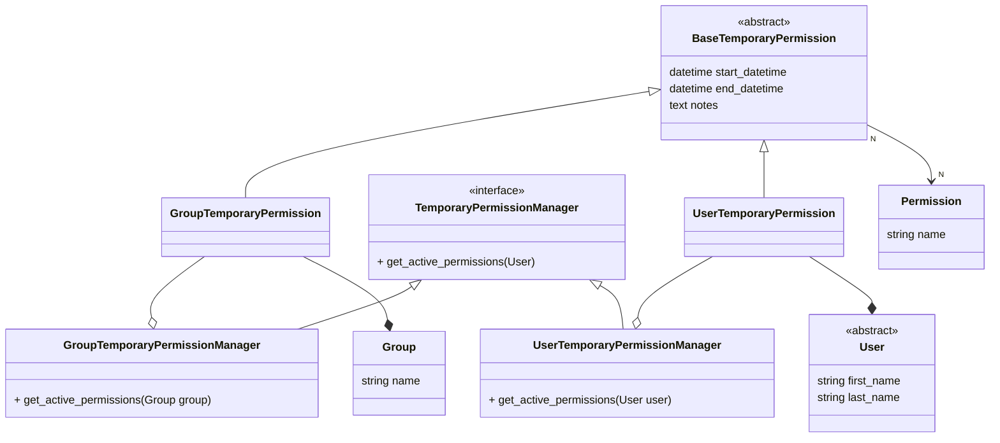
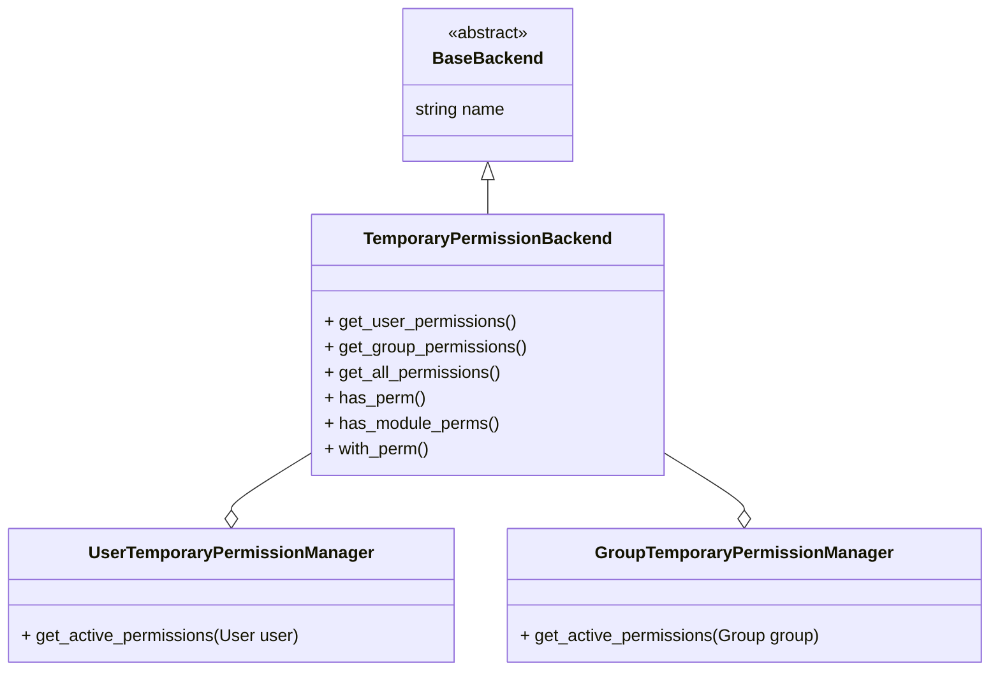

# Models

```mermaid
classDiagram
    class Permission {
        string name
    }
    
    class BaseTemporaryPermission {
        <<abstract>>
        datetime start_datetime
        datetime end_datetime
        text notes
    }
    BaseTemporaryPermission "N" --> "N" Permission
    
    class User {
        <<abstract>>
        string first_name
        string last_name
    }
    
    class Group {
        string name
    }
    
    class TemporaryPermissionManager {
        <<interface>>
        + get_active_permissions(User)
    }
    
    class UserTemporaryPermission 
    UserTemporaryPermission --* User
    BaseTemporaryPermission <|-- UserTemporaryPermission
    
    class GroupTemporaryPermission
    GroupTemporaryPermission --* Group
    BaseTemporaryPermission <|-- GroupTemporaryPermission
    
    class UserTemporaryPermissionManager {
        + get_active_permissions(User user)
    }
    UserTemporaryPermission --o UserTemporaryPermissionManager
    TemporaryPermissionManager <|-- UserTemporaryPermissionManager
    
    class GroupTemporaryPermissionManager {
        + get_active_permissions(Group group)
    }
    GroupTemporaryPermission --o GroupTemporaryPermissionManager
    TemporaryPermissionManager <|-- GroupTemporaryPermissionManager
```

# Authentication backend

```mermaid
classDiagram
    class BaseBackend {
        <<abstract>>
        string name
    }
    
    class TemporaryPermissionBackend {
        + get_user_permissions()
        + get_group_permissions()
        + get_all_permissions()
        + has_perm()
        + has_module_perms()
        + with_perm()
    }
    BaseBackend <|-- TemporaryPermissionBackend
    
    class UserTemporaryPermissionManager {
        + get_active_permissions(User user)
    }
    TemporaryPermissionBackend --o UserTemporaryPermissionManager
    
    class GroupTemporaryPermissionManager {
        + get_active_permissions(Group group)
    }
    TemporaryPermissionBackend --o GroupTemporaryPermissionManager
```